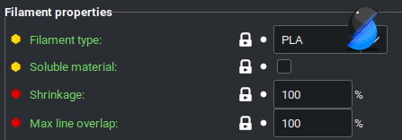
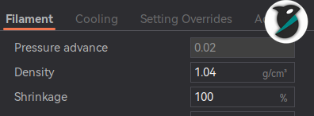
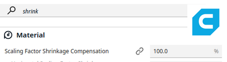

---
hide:
  - navigation
---

<script src="https://cdn.plot.ly/plotly-2.35.2.min.js" charset="utf-8"></script>
<script src="javascript/jexcel.js"></script>
<script src="javascript/jsuites.js"></script>
<link rel="stylesheet" href="stylesheets/jexcel.css" type="text/css" />
<link rel="stylesheet" href="stylesheets/jsuites.css" type="text/css" />


# Calistar Calibration Worksheet

!!! Note
    This worksheet is currently a work in progress! It should have preliminary functionality, but that functionality may have bugs or errors. Please report any bugs you find on the issue tracker.


## Before you start

This worksheet assumes your printer is already set up and you are able to complete a print. If you have not done so (e.g. are just finishing building a Prusa i3 or Voron build from scratch), please ensure that you can successfully print an object before proceeding.

Some links and tips:

- [GitHub](https://github.com/dirtdigger/fleur_de_cali) - always has the latest version of the calculator
- [Wiki](https://github.com/dirtdigger/fleur_de_cali) - Contains hints, tips, and documentation for Calistar
- Hover tips &mdash; indicated by a :material-information-outline:{ title="Lots and lots of important information. Lots and lots of important information. Lots and lots of important information. Lots and lots of important information. Lots and lots of important information. Lots and lots of important information." } symbol &mdash; are available to help clarify things that might need a little bit of extra explanation.
- gcode and Klipper `printer.cfg` snippets can be copied to your clipboard by clicking the icon on the right of the codeblock.


## Your Parameters

Calistar is a *parametric* calibration tool. This worksheet needs to know what parameters you've printed with. Please review the table below and update its contents prior to calibrating your printer.

<table markdown>
<tr markdown>
<td  markdown> Total width (mm) :material-information-outline:{ title="If you printed 'calistar_MxN.stl', then this is the value of M<br>Default: 120" }
</td>
<td> <input type="number" value="120" id="calistarSize" size = "5" onchange="setNominals()"/> mm
</td>
</tr>

<tr markdown>
<td markdown> Number of measurement points :material-information-outline:{ title="If you printed 'calistar_MxN.stl', then this is the value of N<br>Default: 3" }
</td>
<td>
<select id="numMeasPts" name="numMeasPts" onchange="changeNumMeasPts()">
<option>2</option>
<option selected>3</option>
<option>4</option>
<option>5</option>
</select>
</td>
</tr>

<tr markdown>
<td markdown> Slicer Scaling :material-information-outline:{ title="If you didn't scale the model in your slicer, keep this as a 1. <br>Note: slicer scaling is NOT recommended.<br>Default: 1.00" }
</td>
<td> <input type="number" value="1.00" id="printScale" step="0.01" onchange="setNominals()"/>
</td>
</tr>

<tr markdown>
<td markdown> Caliper error (mm) :material-information-outline:{ title="How accurate your calipers are. Note: digital calipers, even though they read to the nearest 0.01mm, are often only actually accurate to 0.02mm<br>Default: 0.01 mm" }
</td>
<td> <input type="number" value="0.01" id="caliper_error" step="0.01" /> mm
</td>
</tr>

<tr markdown>
<td markdown>
Use Sample Error :material-information-outline:{ title="If checked, the worksheet will supplement the error estimate in your calipers by calculating a sample variance<br> Default: checked" }
</td>
<td> <input type="checkbox" value="" id="sample_error" checked onchange = "updateSigma()" />
</td>
</tr>

</table>


## Post-print Worksheet

!!! Warning
    Allow the print to *cool completely*. Then, remove it from the bed prior to measuring. Failure to do either of these steps could result in poor results.


Please see [this wiki page](https://github.com/dirtdigger/fleur_de_cali/wiki/Measuring) for additional tips on orienting the print and measuring hints.


Along each axis, measurements work from the outside in (see figure). Measure in this order:

1. x-axis outside	(horizontal in picture)

2. x-axis inside	(horizontal in picture)

3. y-axis outside	(vertical in picture)

4. y-axis inside	(vertical in picture)

5. Diagonals	(Capital D first, then lowercase d)


<div id="spreadsheet"></div>

<script>

var changed = function(instance, cell, x, y, value) {

    update();
}


var data = [
    ['Outer', 'X', '1', '', '', '', '120', '=AVERAGE(D1:F1)'],
    ['Outer', 'X', '2', '', '', '', '100', '=AVERAGE(D2:F2)'],
    ['Outer', 'X', '3', '', '', '', '80' , '=AVERAGE(D3:F3)'],
    ['Outer', 'X', '4', '', '', '', '60' , '=AVERAGE(D4:F4)'],
    ['Outer', 'X', '5', '', '', '', '40' , '=AVERAGE(D5:F5)'],
    ['Inner', 'X', '1', '', '', '', '120', '=AVERAGE(D6:F6)'],
    ['Inner', 'X', '2', '', '', '', '100', '=AVERAGE(D7:F7)'],
    ['Inner', 'X', '3', '', '', '', '80' , '=AVERAGE(D8:F8)'],
    ['Inner', 'X', '4', '', '', '', '60' , '=AVERAGE(D9:F9)'],
    ['Inner', 'X', '5', '', '', '', '40' , '=AVERAGE(D10:F10)'],
    ['Outer', 'Y', '1', '', '', '', '120', '=AVERAGE(D11:F11)'],
    ['Outer', 'Y', '2', '', '', '', '100', '=AVERAGE(D12:F12)'],
    ['Outer', 'Y', '3', '', '', '', '80' , '=AVERAGE(D13:F13)'],
    ['Outer', 'Y', '4', '', '', '', '60' , '=AVERAGE(D14:F14)'],
    ['Outer', 'Y', '5', '', '', '', '40' , '=AVERAGE(D15:F15)'],
    ['Inner', 'Y', '1', '', '', '', '120', '=AVERAGE(D16:F16)'],
    ['Inner', 'Y', '2', '', '', '', '100', '=AVERAGE(D17:F17)'],
    ['Inner', 'Y', '3', '', '', '', '80' , '=AVERAGE(D18:F18)'],
    ['Inner', 'Y', '4', '', '', '', '60' , '=AVERAGE(D19:F19)'],
    ['Inner', 'Y', '5', '', '', '', '40' , '=AVERAGE(D20:F20)'],
    ['Outer', 'D' ,'1', '', '', '', '120', '=AVERAGE(D21:F21)'],
    ['Outer', 'D' ,'2', '', '', '', '100', '=AVERAGE(D22:F22)'],
    ['Outer', 'D' ,'3', '', '', '', '80' , '=AVERAGE(D23:F23)'],
    ['Outer', 'D' ,'4', '', '', '', '60' , '=AVERAGE(D24:F24)'],
    ['Outer', 'd' ,'1', '', '', '', '120', '=AVERAGE(D25:F25)'],
    ['Outer', 'd' ,'2', '', '', '', '100', '=AVERAGE(D26:F26)'],
    ['Outer', 'd' ,'3', '', '', '', '80' , '=AVERAGE(D27:F27)'],
    ['Outer', 'd' ,'4', '', '', '', '60' , '=AVERAGE(D28:F28)']
];

let worksheet = jspreadsheet(document.getElementById('spreadsheet'), {
    data:data,
    columns: [
        { type: 'text', title:'Type', width:80, readOnly: true },
        { type: 'text', title:'Axis', width:60, readOnly: true  },
        { type: 'text', title:'Location',  width:80, readOnly: true },
        { type: 'numeric', title:'1', width:80 },
        { type: 'numeric', title:'2', width:80 },
        { type: 'numeric', title:'3', width:80},
        { type: 'numeric', title:'Nominal (mm)', width:120, readOnly: true},
        { type: 'numeric', title:'Avg. (mm)', width:100 , readOnly: true, format: '#,##0.00' }
     ],
     nestedHeaders:[
            [
                {
                    title: 'Description',
                    colspan: '3',
                },
                {
                    title: 'Measurements (mm)',
                    colspan: '3',
                }
            ],
        ],
     tableOverflow:true,
     tableHeight:'400px',
     onchange: changed,
});

worksheet.hideIndex();

</script>

<div id = "measurementWarnings" markdown>

!!! Warning
    Found the following issues:

    <span id="validDimensions">You need more measurements to be able to correct the dimensions of your printer.</span>

    <span id="validSkew">You need more measurements to be able to correct the skew of your printer.</span>

    <span id="validInnerOuter">While not required, for best results please match each outer measurement with a corresponding inner measurement, and vice-versa.</span>

    <span id="outoffamily">At least one measurement looks off-nominal. Please double-check your measurements.</span>
</div>

<div id="valideverything" markdown>
!!! Success
    You've entered enough measurements to be able to estimate dimensional error and skew!
</div>

<!--<table style="overflow-y:scroll; height:500px;display:block;" id="measurements">
  <tr>
    <th rowspan=2> Direction </th>
    <th rowspan=2> Location </th>
    <th rowspan=2> Nominal value (mm) </th>
    <th colspan=3 align="center"> Measurements (mm) </th>
    <th rowspan=2> Average (mm) </th>
  </tr>

  <tr>
    <th> 1 </th>
    <th> 2 </th>
    <th> 3 </th>
  </tr>

  <tr class="meas1">
    <td> Outer X </td>
    <td> 1 </td >
    <td> <span class=nom1>120</span> </td>
    <td> <input class="meascell" value="" placeholder="&mdash;" id="x_outer_meas[0][0]" /> </td>
    <td> <input class="meascell" value="" placeholder="&mdash;" id="x1_outer_meas2" /> </td>
    <td> <input class="meascell" value="" placeholder="&mdash;" id="x1_outer_meas3" /> </td>
    <td> <span id="avgX1Outer">120</span> </td>
  </tr>

  <tr>
    <td> 2 </td >
    <td> <span class=nom2>100</span> </td>
    <td> <input class="meascell" value="" placeholder="&mdash;" id="x_outer_meas[0][0]" /> </td>
    <td> <input class="meascell" value="" placeholder="&mdash;" id="x1_outer_meas2" /> </td>
    <td> <input class="meascell" value="" placeholder="&mdash;" id="x1_outer_meas3" /> </td>
    <td> <span id="avgX2Outer">120</span> </td>
  </tr>

  <tr class="meas3">
    <td> 3 </td >
    <td> <span class=nom3>80</span> </td>
    <td> <input class="meascell" value="" placeholder="&mdash;" id="x_outer_meas[0][0]" /> </td>
    <td> <input class="meascell" value="" placeholder="&mdash;" id="x1_outer_meas2" /> </td>
    <td> <input class="meascell" value="" placeholder="&mdash;" id="x1_outer_meas3" /> </td>
  </tr>

  <tr class="meas4">
    <td> 4 </td >
    <td> <span class=nom4>60</span> </td>
    <td> <input class="meascell" value="" placeholder="&mdash;" id="x_outer_meas[0][0]" /> </td>
    <td> <input class="meascell" value="" placeholder="&mdash;" id="x1_outer_meas2" /> </td>
    <td> <input class="meascell" value="" placeholder="&mdash;" id="x1_outer_meas3" /> </td>
  </tr>

  <tr class="meas5">
    <td> 5 </td >
    <td> <span class=nom5>40</span> </td>
    <td> <input class="meascell" value="" placeholder="&mdash;" id="x_outer_meas[0][0]" /> </td>
    <td> <input class="meascell" value="" placeholder="&mdash;" id="x1_outer_meas2" /> </td>
    <td> <input class="meascell" value="" placeholder="&mdash;" id="x1_outer_meas3" /> </td>
  </tr>


  <tr class="meas1">
    <td> Inner X </td>
    <td> 1 </td >
    <td> <span class=nom1>120</span> </td>
    <td> <input class="meascell" value="" placeholder="&mdash;" id="x_outer_meas[0][0]" /> </td>
    <td> <input class="meascell" value="" placeholder="&mdash;" id="x1_outer_meas2" /> </td>
    <td> <input class="meascell" value="" placeholder="&mdash;" id="x1_outer_meas3" /> </td>
  </tr>

  <tr>
    <td> 2 </td >
    <td> <span class=nom2>100</span> </td>
    <td> <input class="meascell" value="" placeholder="&mdash;" id="x_outer_meas[0][0]" /> </td>
    <td> <input class="meascell" value="" placeholder="&mdash;" id="x1_outer_meas2" /> </td>
    <td> <input class="meascell" value="" placeholder="&mdash;" id="x1_outer_meas3" /> </td>
  </tr>

  <tr class="meas3">
    <td> 3 </td >
    <td> <span class=nom3>80</span> </td>
    <td> <input class="meascell" value="" placeholder="&mdash;" id="x_outer_meas[0][0]" /> </td>
    <td> <input class="meascell" value="" placeholder="&mdash;" id="x1_outer_meas2" /> </td>
    <td> <input class="meascell" value="" placeholder="&mdash;" id="x1_outer_meas3" /> </td>
  </tr>

  <tr class="meas4">
    <td> 4 </td >
    <td> <span class=nom4>60</span> </td>
    <td> <input class="meascell" value="" placeholder="&mdash;" id="x_outer_meas[0][0]" /> </td>
    <td> <input class="meascell" value="" placeholder="&mdash;" id="x1_outer_meas2" /> </td>
    <td> <input class="meascell" value="" placeholder="&mdash;" id="x1_outer_meas3" /> </td>
  </tr>

  <tr class="meas5">
    <td> 5 </td >
    <td> <span class=nom5>40</span> </td>
    <td> <input class="meascell" value="" placeholder="&mdash;" id="x_outer_meas[0][0]" /> </td>
    <td> <input class="meascell" value="" placeholder="&mdash;" id="x1_outer_meas2" /> </td>
    <td> <input class="meascell" value="" placeholder="&mdash;" id="x1_outer_meas3" /> </td>
  </tr>


  <tr class="meas1">
    <td> Outer Y </td>
    <td> 1 </td >
    <td> <span class=nom1>120</span> </td>
    <td> <input class="meascell" value="" placeholder="&mdash;" id="x_outer_meas[0][0]" /> </td>
    <td> <input class="meascell" value="" placeholder="&mdash;" id="x1_outer_meas2" /> </td>
    <td> <input class="meascell" value="" placeholder="&mdash;" id="x1_outer_meas3" /> </td>
  </tr>

  <tr>
    <td> 2 </td >
    <td> <span class=nom2>100</span> </td>
    <td> <input class="meascell" value="" placeholder="&mdash;" id="x_outer_meas[0][0]" /> </td>
    <td> <input class="meascell" value="" placeholder="&mdash;" id="x1_outer_meas2" /> </td>
    <td> <input class="meascell" value="" placeholder="&mdash;" id="x1_outer_meas3" /> </td>
  </tr>

  <tr class="meas3">
    <td> 3 </td >
    <td> <span class=nom3>80</span> </td>
    <td> <input class="meascell" value="" placeholder="&mdash;" id="x_outer_meas[0][0]" /> </td>
    <td> <input class="meascell" value="" placeholder="&mdash;" id="x1_outer_meas2" /> </td>
    <td> <input class="meascell" value="" placeholder="&mdash;" id="x1_outer_meas3" /> </td>
  </tr>

  <tr class="meas4">
    <td> 4 </td >
    <td> <span class=nom4>60</span> </td>
    <td> <input class="meascell" value="" placeholder="&mdash;" id="x_outer_meas[0][0]" /> </td>
    <td> <input class="meascell" value="" placeholder="&mdash;" id="x1_outer_meas2" /> </td>
    <td> <input class="meascell" value="" placeholder="&mdash;" id="x1_outer_meas3" /> </td>
  </tr>

  <tr class="meas5">
    <td> 5 </td >
    <td> <span class=nom5>40</span> </td>
    <td> <input class="meascell" value="" placeholder="&mdash;" id="x_outer_meas[0][0]" /> </td>
    <td> <input class="meascell" value="" placeholder="&mdash;" id="x1_outer_meas2" /> </td>
    <td> <input class="meascell" value="" placeholder="&mdash;" id="x1_outer_meas3" /> </td>
  </tr>


  <tr class="meas1">
    <td> Inner Y </td>
    <td> 1 </td >
    <td> <span class=nom1>120</span> </td>
    <td> <input class="meascell" value="" placeholder="&mdash;" id="x_outer_meas[0][0]" /> </td>
    <td> <input class="meascell" value="" placeholder="&mdash;" id="x1_outer_meas2" /> </td>
    <td> <input class="meascell" value="" placeholder="&mdash;" id="x1_outer_meas3" /> </td>
  </tr>

  <tr>
    <td> 2 </td >
    <td> <span class=nom2>100</span> </td>
    <td> <input class="meascell" value="" placeholder="&mdash;" id="x_outer_meas[0][0]" /> </td>
    <td> <input class="meascell" value="" placeholder="&mdash;" id="x1_outer_meas2" /> </td>
    <td> <input class="meascell" value="" placeholder="&mdash;" id="x1_outer_meas3" /> </td>
  </tr>

  <tr class="meas3">
    <td> 3 </td >
    <td> <span class=nom3>80</span> </td>
    <td> <input class="meascell" value="" placeholder="&mdash;" id="x_outer_meas[0][0]" /> </td>
    <td> <input class="meascell" value="" placeholder="&mdash;" id="x1_outer_meas2" /> </td>
    <td> <input class="meascell" value="" placeholder="&mdash;" id="x1_outer_meas3" /> </td>
  </tr>

  <tr class="meas4">
    <td> 4 </td >
    <td> <span class=nom4>60</span> </td>
    <td> <input class="meascell" value="" placeholder="&mdash;" id="x_outer_meas[0][0]" /> </td>
    <td> <input class="meascell" value="" placeholder="&mdash;" id="x1_outer_meas2" /> </td>
    <td> <input class="meascell" value="" placeholder="&mdash;" id="x1_outer_meas3" /> </td>
  </tr>

  <tr class="meas5">
    <td> 5 </td >
    <td> <span class=nom5>40</span> </td>
    <td> <input class="meascell" value="" placeholder="&mdash;" id="x_outer_meas[0][0]" /> </td>
    <td> <input class="meascell" value="" placeholder="&mdash;" id="x1_outer_meas2" /> </td>
    <td> <input class="meascell" value="" placeholder="&mdash;" id="x1_outer_meas3" /> </td>
  </tr>


  <tr class="diag1">
    <td> Diag D </td>
    <td> 1 </td >
    <td> <span class=nom1>120</span> </td>
    <td> <input class="meascell" value="" placeholder="&mdash;" id="x_outer_meas[0][0]" /> </td>
    <td> <input class="meascell" value="" placeholder="&mdash;" id="x1_outer_meas2" /> </td>
    <td> <input class="meascell" value="" placeholder="&mdash;" id="x1_outer_meas3" /> </td>
  </tr>

  <tr class="meas3">
    <td> 2 </td >
    <td> <span class=nom2>100</span> </td>
    <td> <input class="meascell" value="" placeholder="&mdash;" id="x_outer_meas[0][0]" /> </td>
    <td> <input class="meascell" value="" placeholder="&mdash;" id="x1_outer_meas2" /> </td>
    <td> <input class="meascell" value="" placeholder="&mdash;" id="x1_outer_meas3" /> </td>
  </tr>

  <tr class="meas4">
    <td> 3 </td >
    <td> <span class=nom3>80</span> </td>
    <td> <input class="meascell" value="" placeholder="&mdash;" id="x_outer_meas[0][0]" /> </td>
    <td> <input class="meascell" value="" placeholder="&mdash;" id="x1_outer_meas2" /> </td>
    <td> <input class="meascell" value="" placeholder="&mdash;" id="x1_outer_meas3" /> </td>
  </tr>

  <tr class="meas5">
    <td> 4 </td >
    <td> <span class=nom4>60</span> </td>
    <td> <input class="meascell" value="" placeholder="&mdash;" id="x_outer_meas[0][0]" /> </td>
    <td> <input class="meascell" value="" placeholder="&mdash;" id="x1_outer_meas2" /> </td>
    <td> <input class="meascell" value="" placeholder="&mdash;" id="x1_outer_meas3" /> </td>
  </tr>


  <tr class="diag1">
    <td> Diag d </td>
    <td> 1 </td >
    <td> <span class=nom1>120</span> </td>
    <td> <input class="meascell" value="" placeholder="&mdash;" id="x_outer_meas[0][0]" /> </td>
    <td> <input class="meascell" value="" placeholder="&mdash;" id="x1_outer_meas2" /> </td>
    <td> <input class="meascell" value="" placeholder="&mdash;" id="x1_outer_meas3" /> </td>
  </tr>


  <tr class="meas3">
    <td> 2 </td >
    <td> <span class=nom2>100</span> </td>
    <td> <input class="meascell" value="" placeholder="&mdash;" id="x_outer_meas[0][0]" /> </td>
    <td> <input class="meascell" value="" placeholder="&mdash;" id="x1_outer_meas2" /> </td>
    <td> <input class="meascell" value="" placeholder="&mdash;" id="x1_outer_meas3" /> </td>
  </tr>

  <tr class="meas4">
    <td> 3 </td >
    <td> <span class=nom3>80</span> </td>
    <td> <input class="meascell" value="" placeholder="&mdash;" id="x_outer_meas[0][0]" /> </td>
    <td> <input class="meascell" value="" placeholder="&mdash;" id="x1_outer_meas2" /> </td>
    <td> <input class="meascell" value="" placeholder="&mdash;" id="x1_outer_meas3" /> </td>
  </tr>

  <tr class="meas5">
    <td> 4 </td >
    <td> <span class=nom4>60</span> </td>
    <td> <input class="meascell" value="" placeholder="&mdash;" id="x_outer_meas[0][0]" /> </td>
    <td> <input class="meascell" value="" placeholder="&mdash;" id="x1_outer_meas2" /> </td>
    <td> <input class="meascell" value="" placeholder="&mdash;" id="x1_outer_meas3" /> </td>
  </tr>


</table>-->

## Dimensionality Results

Here are your printer's dimensionality results. The goal of this tool is to help you get each axis' error to within 2-sigmas of 0%.

<div id="dimensionFeedback" markdown>
!!! Failure

    There appears to be something wrong with your inputted measurements, and the results in the table and the advice given below should not be trusted. Please ensure your measurements are valid above.

</div>

<div id="dimGraph" style="width:600px;height:250px;"></div>
<script>

var trace1 = {
  x: [0,1],
  y: ['x-axis', 'y-axis'],
  mode: 'markers',
  name: '2-sigma',
  error_x: {
    type: 'data',
    array: [1,2],
    color: '#000000',
    thickness: 1.0,
    width: 5,
    opacity: 1
  },
  marker: {
    color: '#1f77b4',
    size: 1
  },
  type: 'scatter'
};

var trace2 = {
  x: [0,1],
  y: ['x-axis', 'y-axis'],
  mode: 'markers',
  name: '1-sigma',
  error_x: {
    type: 'data',
    array: [0.5,1],
    color: '#1f77b4',
    thickness: 4.5,
    width: 10,
    opacity: 1
  },
  marker: {
    color: '#1f77b4',
    size: 10
  },
  type: 'scatter'
};

var data = [trace1, trace2];

var layout = {xaxis: {
    showgrid: false,
    zeroline: true,
    title   : "Relative error (%)"
},
yaxis: {
    showgrid: false,
    showline: false,
    dash: 'dash'

},
title: {text:'Dimensional Error'}
}


Plotly.newPlot('dimGraph', data, layout, {showSendToCloud: true});

</script>


<table>
    <tr>
        <th colspan=4>Dimensional Correctness
        </th>
    </tr>

    <tr>
        <th>Axis</th>
        <th>Error Estimate</th>
        <th>Correction</th>
        <th>1&sigma; estimate</th>
        <th>#&sigma; off-nominal</th>
    </tr>

    <tr>
        <td>X</td>
        <td class="xdim"><span id="xerror">N/A</span></td>
        <td class="xdim"><span id="xcorrection">N/A</span></td>
        <td class="xdim"><span id="xsigma">N/A</span></td>
        <td class="xdim"><span id="xNumSigma">N/A</span></td>
    </tr>

    <tr>
        <td>Y</td>
        <td class="xdim"><span id="yerror">N/A</span></td>
        <td class="xdim"><span id="ycorrection">N/A</span></td>
        <td class="xdim"><span id="ysigma">N/A</span></td>
        <td class="xdim"><span id="yNumSigma">N/A</span></td>
    </tr>
</table>

<div id = "dimension-1sigma" markdown style='display: none;'>
!!! Success
    Your printer is calibrated to within one standard deviation. Hooray!
</div>

<div id = "dimension-2sigma" markdown style='display: none;'>
!!! Success
    Your printer is calibrated to within two standard deviations. You can try to make adjustments, but they may or may not make a difference.
</div>

<div id = "dimension-3sigma" markdown style='display: none;'>
!!! Warning
    Your printer is calibrated to within three standard deviations. You should probably try to make some adjustments.
</div>

<div id = "dimensionFailure" markdown style='display: none;'>
!!! Failure
    At least one of your axes is more than three standard deviations away from nominal. Your printer's dimensions are not yet calibrated.
</div>

Please read [this wiki page](https://github.com/dirtdigger/fleur_de_cali/wiki/Dimensionality) for help interpreting the results.

### How to fix your printer's dimensionality

<div id = "dimensionsLookGood" markdown style = 'display:none;'>
!!! info
    Your print came out to within two standard deviations of nominal in each direction. You don't necessarily need to make any of the adjustments from this section, but you are welcome to if desired.
</div>

<div id = "dimensionNeedAdjusted" markdown style = 'display:none;'>

There are two possible reasons that the dimensionality of a print could be off -- shrinkage and miscalibrated stepper motors. Please see [this section](https://github.com/dirtdigger/fleur_de_cali/wiki/Dimensionality#how-does-calistars-spreadsheet-determine-if-its-shrinkage) of the wiki for further discussion of these two effects. Below is some advice based on the outcome of your print.

<div id = "possibleShrinkage" style = 'display:none;' markdown>

Your print appears to be smaller than nominal, but not so small as to rule out shrinkage. To help you understand the *probable* reason that your print is off, please select the filament you printed with from the dropdown below.

<table markdown>
<tr markdown>
<td markdown>
Print Material :material-information-outline:{ title="This is used to help determine whether you're likely experiencing shrinkage.<br> Default: PLA" }
</td>
<td>
<select id="materials" name="materials" onchange="updateMaterial()">
<option selected>PLA</option>
<option>PETG</option>
<option>ABS</option>
<option>Other</option>
</select>
</td>
</tr>
<tr markdown>
<td markdown>Max expected shrinkage:material-information-outline:{ title="What percentage of shrinkage you'd typically expect from the selected material due cooling down from the typical print temperature." }</td>
<td markdown id="expectedShrinkage"></td>
</tr>
<tr markdown>
<td markdown>Your error (x, y)</td>
<td markdown id="yourCorrection"></td>
</tr>

</table>

</div>

<div id = "printTooBig" markdown style = 'display:none;'>
!!! info
    Your print came out bigger than nominal, so you are not likely to be facing shrinkage. It is recommended that you adjust your x- and y-steps in your printer's firmware (Klipper or Marlin) using the instructions below.
</div>


<div id = "probableShrinkage" markdown style = 'display:none;'>
!!! info
    Your print came out smaller than nominal. Based on your selected materials, it appears to fall within the bounds of probable shrinkage due to cooling. It is recommended that you adjust your shrinkage factor in your slicer, or scale up the print to compensate.
</div>


<div id = "probablyNotShrinkage" markdown style = 'display:none;'>
!!! info
    Your print came out smaller than nominal. However, based on your inputted dimensions and selected materials, this is probably not shrinkage. It is recommended that you adjust your x- and y-steps in your printer's firmware (Klipper or Marlin) using the instructions below.
</div>


</div>

Should you decide to adjust your settings to fix the dimensionality of the print, please expand the relevant subsection below for detailed instructions. Please note that only Klipper and Marlin are supported firmwares currently. RepRap support is planned.


=== "SuperSlicer/OrcaSlicer/BambuStudio/Cura"

    These slicers have per-filament	shrinkage compensation built in! As of writing (September, 2024), PrusaSlicer is not included in this group.

    1. Get your current shrinkage value from your slicer

        SuperSlicer: Filament settings -> Filament -> Shrinkage

        

        OrcaSlicer/BambuStudio: Filament settings -> Filament -> Shrinkage

        

        Cura: search for "shrinkage"

        

    2. If you already have a shrinkage value, enter your current shrinkage setting (otherwise, keep the default value).

        Current shrinkage setting: <input value="" placeholder="100" id="oldShrinkage" onchange="updateShrinkage()" size="5"/>%

    3. Your adjusted shrinkage setting is: <span id="shrinkage">N/A</span></td>. Make sure you save your filament profile!


=== "Other Slicers"
    As a last ditch effort that works for any slicer, you can scale up your parts to account for shrinkage. Note, however, that this must be done for every part you slice.

    Scale your model to: <span id="slicerscaling">NaN</span>%

=== "Klipper"
    1. In your `printer.cfg`, find and enter your current values for rotation_distance. (Note: the placeholder suggestion of 40 mm is for an LDO Motors Voron 2.4 kit).

        | Section     | *Current* `rotation_distance`|
        | ----------- | ---------------- |
        | `[stepper_x]` | <input value="" placeholder="40.000" id="oldStepperX" onchange="updateXYRotation()"/>  |
        | `[stepper_y]` | <input value="" placeholder="40.000" id="oldStepperY" onchange="updateXYRotation()"/>  |

    2. If your printer is CoreXY, check the box below. :material-information-outline:{ title="CoreXY behaves differently from cartesian. The x-direction is a mix of A and B motors, and similarly for y. Checking this will average the dimensionality error across both A and B motors." }

        CoreXY movement: <input type="checkbox" value="" id="klippercorexy" checked onchange="updateXYRotation()" />

    3. Your printer's corrected values are as follows:

        In section `[stepper_x]`:

        ``` {gcode id="klipper_stepper_x"}
        rotation_distance: 40.000
        ```

        In section `[stepper_y]`:

        ``` {gcode id="klipper_stepper_y"}
        rotation_distance: 40.000
        ```


=== "Marlin"
    1. In a console, type [M92](https://marlinfw.org/docs/gcode/M092.html) into a console to get your current X- and Y-steps per mm and enter them below.

        | Axis | *Current* Value|
        | ----------- | ---------------- |
        | X | <input value="" placeholder="80.000" id="xstep" onchange="updateXYSteps()"/>           |
        | Y | <input value="" placeholder="80.000" id="ystep" onchange="updateXYSteps()"/>           |

    2. If your printer is CoreXY, check the box below. :material-information-outline:{ title="CoreXY behaves differently from cartesian. The x-direction is a mix of A and B motors, and similarly for y. Checking this will average the dimensionality error across both A and B motors." }

        CoreXY movement: <input type="checkbox" value="" id="marlincorexy" checked onchange="updateXYSteps()" />

    3. In a console, paste the following:

        ``` {gcode id="marlindimensions"}
        M92 X80 Y80; updates x- and y-steps with your values
        ```

    4. You should see "Recv. ok". Then type
        ``` gcode
        M500
        ```

        in your console to save the new settings.


## Skew Results

!!! Note
    Some printers such as the Prusa i3 MK3S+ have the ability to measure and correct this on their own. If you use such a printer, you can skip this step. Others, e.g. Bambulab printers and the Prusa Mini, do not have a way to compensate skew. Thus this measurement is for informational purposes only for those printers.


<div id="skewFeedback" markdown>
!!! Failure

    There appears to be something wrong with your inputted measurements, and the results in the table and the advice given below should not be trusted. Please ensure your measurements along the x-axis, y-axis, D-axis, and d-axis are valid above.

</div>

Here are your printer's skew results. The goal of this tool is to help you get your skew to within 2-sigmas of 0&deg;.

<div id="skewGraph" style="width:600px;height:250px;"></div>
<script>

var trace1 = {
  x: [0],
  y: ['skew'],
  mode: 'markers',
  name: '2-sigma',
  error_x: {
    type: 'data',
    array: [1],
    color: '#000000',
    thickness: 1.0,
    width: 5,
    opacity: 1
  },
  marker: {
    color: '#1f77b4',
    size: 1
  },
  type: 'scatter'
};

var trace2 = {
  x: [0],
  y: ['skew'],
  mode: 'markers',
  name: '1-sigma',
  error_x: {
    type: 'data',
    array: [0.5],
    color: '#1f77b4',
    thickness: 4.5,
    width: 10,
    opacity: 1
  },
  marker: {
    color: '#1f77b4',
    size: 10
  },
  type: 'scatter'
};

var data = [trace1, trace2];

var layout = {xaxis: {
    showgrid: false,
    zeroline: true,
    title   : "Skew angle (degrees)"
},
yaxis: {
    showgrid: false,
    showline: false,
    dash: 'dash'

},
title: {text:'Skew angle'}
}


Plotly.newPlot('skewGraph', data, layout, {showSendToCloud: true});

</script>

<table>
    <tr>
        <th colspan=4>Printer Skew
        </th>
    </tr>

    <!--<tr>
        <th>Quantity</th>
        <th>Calculated</th>
        <th>Correction</th>
        <th>1&sigma; estimate</th>
        <th>#&sigma; off-nominal</th>

    </tr>

    <tr>
        <td>Angle of Parallelogram</td>
        <td class="xdim"><span id="parAngle">N/A</span></td>
        <td class="xdim"><span id="parCorrection">N/A</span></td>
        <td class="xdim"><span id="parSigma">N/A</span></td>
        <td class="xdim"><span id="parNumSigmas">N/A</span></td>

    </tr>

    <tr>
        <td>Skew Angle</td>
        <td class="xdim"><span id="skewAngle">N/A</span></td>
        <td class="xdim"><span id="skewCorrection">N/A</span></td>
        <td class="xdim"><span id="skewSigma">N/A</span></td>
        <td class="xdim"><span id="skewNumSigmas">N/A</span></td>
    </tr>-->

    <tr>
        <th>Quantity</th>
        <td>Parallelogram angle (&deg;)</td>
        <td>Skew (&deg;)</td>
        <td>Correction (&deg;)</td>
        <td>1&sigma; estimate (&deg;)</td>
        <td>#&sigma; off-nominal</td>

    </tr>

    <tr>
        <th>Value</th>
        <td class="xdim"><span id="parAngle">N/A</span></td>
        <td class="xdim"><span id="skewAngle">N/A</span></td>
        <td class="xdim"><span id="skewCorrection">N/A</span></td>
        <td class="xdim"><span id="skewSigma">N/A</span></td>
        <td class="xdim"><span id="skewNumSigmas">N/A</span></td>

    </tr>


    <!--<tr>
        <th>Quantity</th>
        <th>Value</th>
    </tr>

    <tr>
        <td>Angle of Parallelogram</td>
        <td class="xdim"><span id="parAngle">N/A</span></td>
    </tr>

    <tr>
        <td>Skew angle</td>
        <td class="xdim"><span id="skewAngle">N/A</span></td>
    </tr>

    <tr>
        <td>Correction</td>
        <td class="xdim"><span id="skewCorrection">N/A</span></td>
    </tr>

    <tr>
        <td>1&sigma; estimate</td>
        <td class="xdim"><span id="skewSigma">N/A</span></td>
    </tr>

    <tr>
        <td>#&sigma; off-nominal</td>
        <td class="xdim"><span id="skewNumSigmas">N/A</span></td>
    </tr>-->


</table>


<div id = "skew-1sigma" markdown style='display: none;'>
!!! Success
    Your printer doesn't seem to be skewed in any meaningful way. Hooray!
</div>

<div id = "skew-2sigma" markdown style='display: none;'>
!!! Success
    Your printer's skew is calibrated to within two standard deviations. You can try to make adjustments, but they may or may not make a difference.
</div>

<div id = "skew-3sigma" markdown style='display: none;'>
!!! Warning
    Your printer's skew is calibrated to within three standard deviations. You should probably try to make some adjustments.
</div>

<div id = "skewFailure" markdown style='display: none;'>
!!! Failure
    Your printer is almost definitely skewed. You should try to fix it if your model supports it.
</div>


Please read [this wiki page](https://github.com/dirtdigger/fleur_de_cali/wiki/Skew) for additional information involving skew.


### How to fix your printer's skew

How you go about fixing your skew depends on the type of firmware you are running. Currently only Klipper and Marlin are supported, but RepRap support is planned.

Select the relevant subsection below to get instructions on how to proceed.

=== "Klipper"
    See the [Klipper documentation](https://www.klipper3d.org/Skew_Correction.html) for details. Please read it to understand what you are doing!

    If you have already applied skew correction to this plane, please enter the results of that below. Otherwise, you can leave these as blanks for now. (Hint: Check your printer.cfg if you're not sure).

    | Length | Old Value |
    | ------ | --------- |
    | AC     | <input value="" placeholder="(blank)" id="oldAC" onchange="updateSkewKlipper()" /> |
    | BD     | <input value="" placeholder="(blank)" id="oldBD" onchange="updateSkewKlipper()" /> |
    | AD     | <input value="" placeholder="(blank)" id="oldAD" onchange="updateSkewKlipper()" /> |
    | Correction | <span id="oldCorrection">0</span>&deg;          |


    Your updated net length parameters are listed below. Keep these numbers handy if you want to iterate the skew correction process!

    | Length | New Value |
    | ------ | --------- |
    | AC     | <span id = "newAC"></span> |
    | BD     | <span id = "newBD"></span> |
    | AD     | <span id = "newAD"></span> |
    | Correction | <span id="totalCorrection">0</span>&deg; |

    To fix your printer's skew:

    1. Ensure [skew_correction] is set in your `printer.cfg`

    2. Your skew correction gcode is below. Copy and paste it into a console.

        ``` {gcode id="klipperskew"}
        SET_SKEW XY=100,100,70.71
        ```
    3. Save your skew profile with

        ``` gcode
        SKEW_PROFILE SAVE=my_skew_profile
        ```

    4. Finally, ensure that you load the skew profile, e.g. in your `PRINT_START` macro:

        ``` gcode
        SKEW_PROFILE LOAD=my_skew_profile
        ```

    If you'd like to confirm that the skew has been calculated correctly, you can have Klipper calculate your skew directly by entering this into a console:

    ``` {gcode id="klippercalcskew"}
    CALC_MEASURED_SKEW AC=100 BD=100 AD=70.71
    ```

    Finally, if you wish to delete an old skew profile, use `SKEW_PROFILE REMOVE=my_skew_profile` as per the Klipper instructions.

=== "Marlin"
    !!! Note
        Although planned, skew cannot yet be iteratively tuned for Marlin with Calistar. Therefore, if you have Marlin-based firmware and have already attempted to correct your  skew, you should remove the correction before trying to fix it further.

    !!! Note
        `SKEW_CORRECTION` needs to be uncommented in your firmware's `Configuration.h`. Re-compiling Marlin is out of scope of this tool, but you can read about how to do it [by clicking here](https://marlinfw.org/docs/configuration/configuration.html).

    See the [Marlin documentation](https://marlinfw.org/docs/gcode/M852.html) for details. Please read it to understand what you are doing!

    Assuming your firmware has been compiled with `SKEW_CORRECTION` uncommented, you can simply paste the custom skew correction gcode below into a console.

    ``` {gcode id="marlinskew"}
    M582 I0; sets the skew factor
    M500; saves the result to EEPROM
    ```

